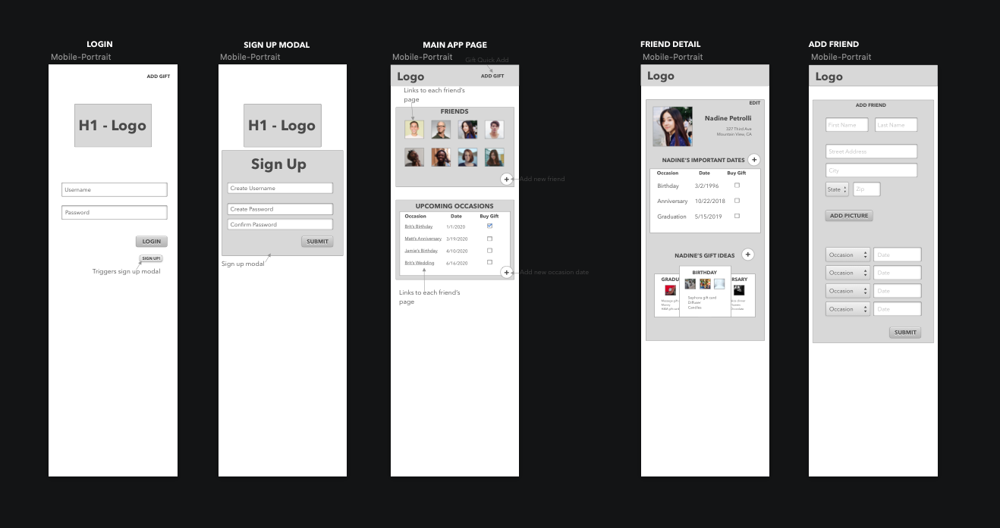

# ForgetMeNot

## The Idea
ForgetMeNot is a simple way to store gift ideas for the important (or not so favorite) people in your life. The idea was to solve my gift buying nightmare. I kept losing track of the gift ideas I'd  made on my phone or the date of the birthday/anniversary/important date would sneak up on me, leaving me no time to actually purchase the gift.
Enter ForgetMeNot.  A simple way to store gift ideas and make sure you order them in time.  Wherever you are.  Whoever you are with.  No matter the occasion.  ForgetMeNot's got your back.

## How it Works
ForgetmeNot is a beautifully simple web app that quickly stores a note or photo of a gift idea for a special person in your life.  Out at the store and your wife says, "I love this dress!"  Snap a photo and win those brownie points.  Your son finds the perfect toy at the downtown toy shop?  Add it to their list and be their birthday hero.  Little sister is graduating from college?  Add Dr. Seuss's Oh, The Places You'll Go! and impress your family.
Through a simple interface, you can quickly add a photo, note, or idea to a friend or family member.  If you have time, add a date so ForgetMeNot can remind you.  In a hurry?  Add the date later!

## Trello
 

## Wireframe
 

## Project Schedule 
*Google Calendar for April and May 
https://calendar.google.com/calendar?cid=czhuajZyZmJtbzNhbDdzZmRzdjNwcmFxN2tAZ3JvdXAuY2FsZW5kYXIuZ29vZ2xlLmNvbQ 

